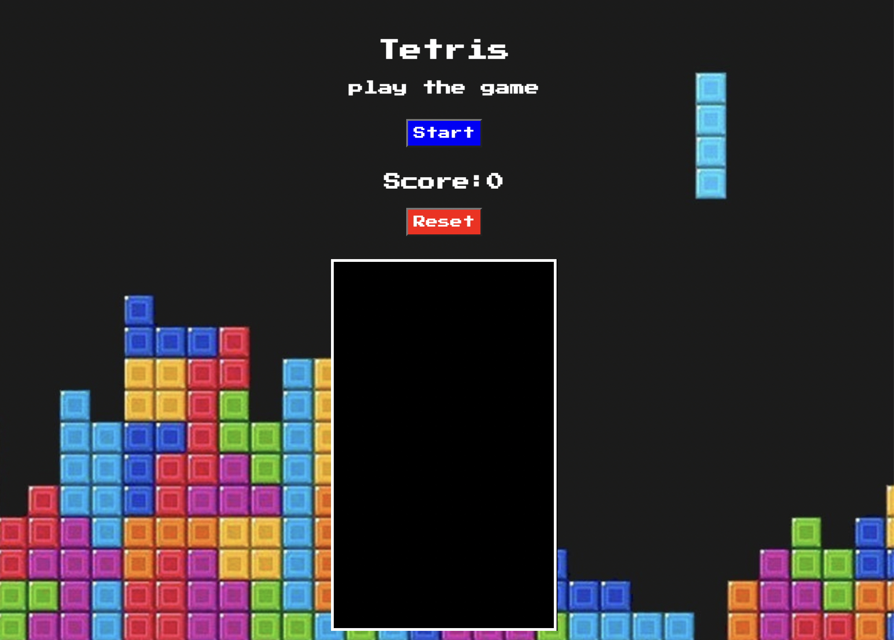

# Tetris Challenge Part 1

In this guide, I will walk you through building the first part of a tetris game. We will apply our learnings from the first two weeks of General Assembly's Software Engineering Immersive program. 

 
# HOW TO PLAY 
This is a very simple game to play. The only required controls are the following:

1. **Left and Right arrow:** Moves the block left or right
2. **Down Arrow:** Accelerates the block's fall
3. **A & D Key:** Rotates the block


To play Tetris online visit: https://janethl.github.io/project-1-example/

## Start Up Screen:
Press the start button to begin playing! 



The reset game will restart your game and set your score to zero. 

# HOW TO INSTALL

1. *`Fork`* and *`Clone`* this respository to your local machine
2. Open `index.html` in your browser to play or 
3. Open the directory in your text editor of choice to view or edit the code


# HOW IT WORKS


Steps:

// Picked one block piece to start off drawing the entire structure and functions of game
// Blocks are built using an array of arrays and filling them in with 0’s and one’s

```javascript
const blocks = [
    //include four rows to make rotation easier
    [0, 0, 0],
    [0, 1, 1],
    [1, 1, 0],
];
```

// Created a function drawBlocks() to draw the first block

// Used forEach and Loops to draw the the squares that aren’t zero 


```javascript

function drawBlocks(blocks, offset){
//use .forEach method to iterate over every row and y index 
blocks.forEach((row, y) => {
    //grab the value and x index 
    row.forEach((value, x) => {
        // if value is not zero we draw the square
        if (value !== 0) {
            ctx.fillStyle = 'blue';
            ctx.fillRect(x + offset.x, // offset will allow us to move the blocks later
                         y + offset.y, 
                         1, 1);
        }
    });
});
}
```

//I added a function  draw() to draw game continuosly 

```javascript
//create blocks using function draw () that passes our player position and blocks to update  game constantly
function draw (){
    ctx.fillStyle = 'black';
    ctx.fillRect(0, 0, canvas.width, canvas.height);
    
    drawBlocks(field, {x:0, y:0}); //draw the squares inside zero's that are being populated as block sets`console.log(field)`
    drawBlocks(player.blocks, player.pos); 
}

```

// Our update() function starts our game this function calls draw() and uses requestAnimationFrame()
//requestAnimationFrame() tells the browser to perform an animation and requests that the browser call a specified function to update an animation before the next repaint

// we have a dropCounter variable that we default to 0 whenever we need to move our piece back to top

//we have a dropInterval set to 500 milliseconds so our pices drop every 1/2 a second

// we create our field by passing in a width of 12 and height of 22 into our function createBlocks()
createBlocks()

// join() function is where join or print our players position to the field that we built. It copies the players position into the field.

//our collide() function we’re checking to see where our squares on our field are not zero then they collide
 
//Keyboard Controls. Set an event listener for whenever our arrows and and Keys A& D are clicked

//in playerMove() we use our collide() function to check if our pieces collide with the field or other pieces 

//rotate() function is taking our rows annd converting them into columns 


```javascript  
const canvas = document.getElementById('tetris'); //access canvas
const ctx = canvas.getContext('2d');
const button = document.getElementById('start');
const resetButton = document.getElementById('reset'); //grab reset button
ctx.scale(20,20); // used to scale everything on canvas by 20


//add event listener to the start button so that when clicked the game is rendered 
document.addEventListener("DOMContentLoaded", function (e) {
    button.addEventListener('click', () => {
            //remove button to prevent another block to be rendered
            button.style.display = 'none';
    //add another event listener for when reset button is clicked
    resetButton.addEventListener('click', () => {
        // console.log("clicked!") // check  to see if eventListener is working
        field.forEach(row => row.fill(0)); //clear by filling rows with zeros
        player.pos.y = 0;
        player.pos.x = 5;
        // location.reload();
        // return false
        
    })

const blocks = [
    //include four rows to make rotation easier
    [0, 0, 0],
    [0, 1, 1],
    [1, 1, 0],
];

//convert rows into coloumns and reverse the rows
function rotate(blocks, control) {
    for (let y = 0; y < blocks.length; y++ ){
        for(let x = 0; x < y; x++){
            [
                blocks[x][y],
                blocks[y][x],

            ] = [
                blocks[y][x],
                blocks[x][y],
            ];

        }
    }
    if (control > 0){
        blocks.forEach(row => row.reverse());
    } else {
        blocks.reverse();
    }
}

// create a function to save all the pieces
function createBlocks(w, h){
    const blocks = []; // set an empty array
    while (h--){ // h= 2  while the height is not zero decrease h by 1 
        blocks.push(new Array(w).fill(0));
    }
   return blocks;
}

// create a collision detect function 
function collide(field, player){
    //assign the bocks and position to variable b & o, saving the position of block 
    const b = player.blocks;
    const o = player.pos; 
    //iterate over the players "blocks" position
    // create for loop to loop over y (rows)
    for(let y = 0; y < b.length; y++){
            //create for loop to loop over x
        for(let x = 0; x < b[y].length; x++){
            // iterate over players block, if the blocks position of player is not zero and  
            if(b[y][x] !== 0 && //if the players blocks y row and x column is not zero (they collide)
                (field[y + o.y] && // and if fields row exist, if it doesn't exist it will count as collision 
                field[y + o.y][x + o.x]) !== 0){ //if it exist grab the child and if they are not zero (they collide) so return true
                    return true; // return true if the  conditions are not equal to zero, meaning that they have an x or y position

                }
                    
        }
    }
    return false; // if they are zero they don't collide 
}
// now that we have a collide function we can use it within a function that drops the players block
//create blocks using function draw () that passes our player position and blocks to update  game constantly
function draw (){
    ctx.fillStyle = 'black';
    ctx.fillRect(0, 0, canvas.width, canvas.height);
    
    drawBlocks(field, {x:0, y:0}); //draw the squares inside zero's that are being populated as block sets`console.log(field)`
    drawBlocks(player.blocks, player.pos); 
}

function drawBlocks(blocks, offset){
//use .forEach method to iterate over every row and y index 
blocks.forEach((row, y) => {
    //grab the value and x index 
    row.forEach((value, x) => {
        // if value is not zero we draw the square
        if (value !== 0) {
            ctx.fillStyle = 'blue';
            ctx.fillRect(x + offset.x, // offset will allow us to move the blocks later
                         y + offset.y, 
                         1, 1);
        }
    });
});
}
//add a function that copies players position inside the field that can detect collision

function join(field, player){
    player.blocks.forEach((row, y) => { // pull row and y index from the player's block 
        row.forEach((value, x) => { //iterate over row to get value and x index
            if (value !== 0) { //ignore zero values
                field[y + player.pos.y][x + player.pos.x] = value; //copy the values into the field 
            }
        });
    });

}


//500 milliseconds (.5 sec) to drop the piece one step
let dCounter = 0; 
let dropInterval = 500;

//get difference of time
let lastTime = 0; 

//call the draw() function and requestAnimationFrame ()
//requestAnimationFrame() tells the browser  to perform an animation and requests that the browser call a specified function to update an animation before the next repaint
//deltaTime is a useful variable for animation contains the time difference between the beginning of the previous frame and the beginning of the current frame in milliseconds
function update(time = 0) { //drop the blocks using the requestAnimationFrame() by grabbing time and defaulting to 0
    // console.log(time); //console.log to see the time since your page loaded
    const deltaTime = time - lastTime; 
    lastTime = time;
    // console.log(deltaTime);

    dCounter += deltaTime; //add drop count to the difference between the prev frame and current frame 
    if (dCounter > dropInterval){
        player.pos.y++;
        if (collide(field, player)){  //if  drop and collide it means the block touches the bottom of screen or another block
            player.pos.y--; // if collide then move block player one up 
            join(field, player);
            player.pos.y = 0; // set  player's block to the top to start over 
        }
        dCounter = 0; // reset to 0 so it can count again 
    }

    draw();
    requestAnimationFrame(update);
}

const field = createBlocks(12, 20); //12 squares wide and 20 height 
// console.log(field); console.table(field);
// add  player with a position and block
const player = {
    pos: {x: 5, y:-2},
    blocks: blocks,
}
// use the following EventListener to find key codes
// document.addEventListener('keydown', e =>{
//     console.log(e);
// })
document.addEventListener('keydown', e => {
    if (e.keyCode === 37) {
        function playerMove(control){
            player.pos.x += control;
        if (collide(field, player)){ //if we drop and collide it means we touch the bottom of screen or another block
            player.pos.x -= control; // this is moving our player one up if it's colliding, 
        }};
        playerMove(-1);   //move left one
    } else if (e.keyCode === 39){ 
        function playerMove(control){
            player.pos.x += control; // take players position x and move + 1 to the right
        if (collide(field, player)){ // if they collide
            player.pos.x -= control;
        }};
        playerMove(+1); //move right one
    } else if (e.keyCode === 40){
        player.pos.y++; 
        if (collide(field, player)){ //collide means block touches the bottom of screen or another block
            player.pos.y--;  // if collide then move block player back up
            join(field, player);
            player.pos.y = -2; // set player's block to the top to start over 
        }
                dCounter = 0;

    } else if (e.keyCode === 65 ){ //set keys Q and W to rotate our blocks
        const pos = player.pos.x;
        let offset = 1; 
        function playerRotate(control){
            rotate(player.blocks, control);
           }
           playerRotate(+1);
         while(collide(field, player)){  //rotating blocks exits the canvas walls unless  collison is checked every roatation
             player.pos.x += offset; 
             offset = -(offset + (offset > 0 ? 1 : -1));
             if(offset > player.blocks[0].length){
                 rotate(player.blocks, control);
                player.pos.x = pos; 
                return;
         }
    }
    
}  else if (e.keyCode === 68){
    const pos = player.pos.x;
    let offset = 1; 
    function playerRotate(control){
         rotate(player.blocks, control);
        }
        playerRotate(-1);// if the block collides then move players block by one
     while(collide(field, player)){  // rotating our blocks it exits the canvas walls; check collison everytime rotate
         player.pos.x += offset; 
         offset = -(offset + (offset > 0 ? 1 : -1)); //
         if(offset > player.blocks[0].length){
             rotate(player.blocks, control);
            player.pos.x = pos; 
            return;
        }
    }
 }
 console.log(field); console.table(field);
});

update(); // start the game with update

})});


```


# FUTURE CONSIDERATIONS

- Create 6 more blocks with if statements
- Create a function to randomly select a block
- Add colors to blocks 
- Need to add a game over screen
- Count filled rows using a for loop and clear rows once full
- Add a function that updates the score 
- Add styling to buttons
- Add SMS functionality with API to challenge friends to beat high score a game 


# PROCESS WORK

## Initial Wireframes:
Initial Wireframes go here ( images )

## Scratch Work:

Scratch Work goes here
